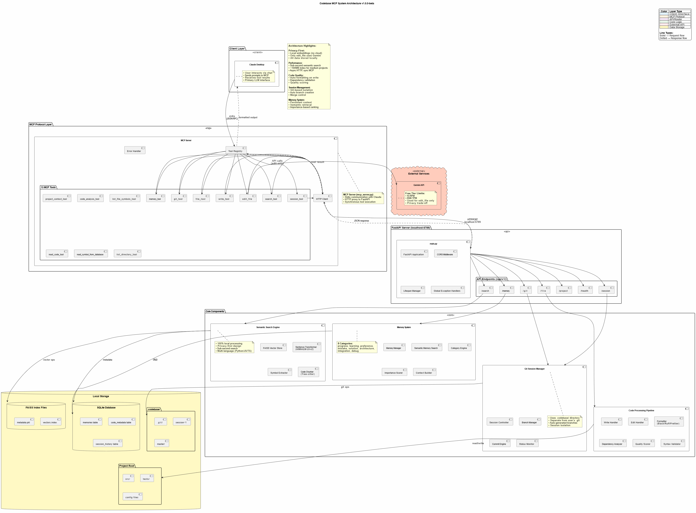

# Codebase MCP

> **Turn Claude into Your Personal Coding Assistant - Privacy-First, Cost-Effective, Open Source**

[](LICENSE)
[](https://www.python.org/downloads/)
[](https://modelcontextprotocol.io)
[](https://github.com/danyQe/codebase-mcp/releases)

**Codebase MCP** is an open-source AI-powered development assistant that connects Claude Desktop (or any MCP-compatible LLM) to your codebase through the Model Context Protocol. Stop paying for separate coding assistants - if you already have a Claude subscription, that's all you need.

📖 **[Read Full Documentation](https://danyqe.github.io/codebase-mcp/)** | 🏗️ **[Architecture](./architecture.puml)** | 🤝 **[Contributing](./CONTRIBUTING.md)**

---

## 🌟 Why Codebase MCP?

### The Problem
Modern AI coding assistants like Cursor, Windsurf, and others charge **$20-40+/month** on top of your existing LLM subscription. If you already pay for Claude, why pay again for a coding assistant?

### The Solution
**Codebase MCP** turns your existing Claude subscription into a powerful coding assistant:
- ✅ **One subscription** - Use your existing Claude Pro/Team plan
- ✅ **Privacy-first** - Local embeddings and processing (except edit operations)
- ✅ **Open source** - Apache 2.0 license, community-driven
- ✅ **Extensible** - Works with any MCP-compatible LLM via Model Context Protocol
- ✅ **Lightweight** - ~100MB memory footprint for medium projects
- ✅ **Fast** - Sub-second semantic search with local FAISS indexing

---

## ⚡ Quick Start

### Prerequisites
- **Python 3.11+**
- **Claude Desktop** (or any MCP-compatible client)
- **Git** installed
- **[uv](https://github.com/astral-sh/uv)** package manager (recommended)

### Installation

**1. Clone the repository:**
```bash
git clone https://github.com/danyQe/codebase-mcp.git
cd codebase-mcp
```

**2. Install globally (recommended):**
```bash
# Install uv if you haven't
pip install uv

# Create virtual environment and install dependencies
uv venv
source .venv/bin/activate  # On Windows: .venv\Scripts\activate
uv pip install -r requirements.txt

# Install formatters globally (required for code formatting)
pip install black ruff
```

**3. Configure Gemini API (for edit tool):**
```bash
# Create .env file
cp .env.example .env

# Get free API key from: https://aistudio.google.com/app/apikey
# Add to .env:
GEMINI_API_KEY=your_api_key_here
```

**4. Configure Claude Desktop:**

Add to your `claude_desktop_config.json`:
```json
{
  "mcpServers": {
    "codebase-manager": {
      "command": "/path/to/your/.venv/bin/python",
      "args": [
        "/path/to/codebase-mcp/mcp_server.py"
      ]
    }
  }
}
```

**5. Start the FastAPI server:**
```bash
# In a separate terminal, navigate to your project directory
python main.py /path/to/your/project

# Server starts on http://localhost:6789
# You can access the web dashboard at: http://localhost:6789
```

**6. Use with Claude Desktop:**
- Restart Claude Desktop
- Start chatting - Claude now has access to 13+ MCP tools for codebase management!

---

## 🎯 Key Features

### 🔍 **Semantic Code Search**
- AI-powered code understanding with local embeddings
- Multi-language support (Python, JavaScript, TypeScript)
- Symbol-level indexing (functions, classes, interfaces)
- Fuzzy search and exact matching modes

### 🧠 **Persistent Memory System**
- Remember context across chat sessions
- Categorize learnings: progress, mistakes, solutions, architecture
- Semantic memory search with importance scoring
- Never repeat the same mistake twice

### 🌿 **Session-Based Git Workflow**
- Isolated development branches for each feature
- Automatic commit tracking in `.codebase` directory
- Separate from user's `.git` - track AI changes independently
- Auto-merge support with quality gates

### ✍️ **Intelligent Code Writing**
- **Write Tool**: Create new files with auto-formatting and quality scoring
- **Edit Tool**: AI-assisted editing with Gemini integration (inspired by Cursor)
- **Quality Gates**: Auto-commit only when code quality ≥ 80%
- **Dependency Checking**: Prevent code duplication and missing imports

### 🎨 **Auto-Formatting**
- **Python**: Black + Ruff (PEP 8 compliant)
- **TypeScript/JavaScript**: Prettier + ESLint
- **Quality Scoring**: Automatic code quality assessment
- **Error Recovery**: Intelligent retry with corrections

### 📊 **Project Intelligence**
- Real-time codebase analysis
- File structure visualization
- Dependency tracking
- Symbol extraction and indexing

---

## 🏗️ Architecture

```
┌─────────────────┐
│ Claude Desktop  │  User interacts via chat
└────────┬────────┘
         │ MCP Protocol (stdio)
         ↓
┌─────────────────┐
│   MCP Server    │  13+ Tools (proxy layer)
│  (mcp_server.py)│  Lightweight, fast
└────────┬────────┘
         │ HTTP/REST
         ↓
┌─────────────────┐
│ FastAPI Server  │  Port 6789 (main.py)
│   Core Engine   │  40+ API endpoints
└────────┬────────┘
         │
    ┌────┴─────┬─────────┬──────────┐
    ↓          ↓         ↓          ↓
┌────────┐ ┌──────┐ ┌────────┐ ┌───────────┐
│Semantic│ │Memory│ │  Git   │ │Code Tools │
│ Search │ │System│ │Manager │ │  Pipeline │
└────────┘ └──────┘ └────────┘ └───────────┘
    │          │         │          │
    └──────────┴─────────┴──────────┘
               ↓
    ┌──────────────────────┐
    │   Local Storage      │
    │ • FAISS (vectors)    │
    │ • SQLite (metadata)  │
    │ • .codebase (git)    │
    └──────────────────────┘
```

**Privacy Note:** All processing is local except the edit tool, which uses Google's free Gemini API for AI-assisted code editing. Only the edited file is sent to Gemini - no project context or history.




---

## 🛠️ Available Tools

Codebase MCP provides **13 specialized MCP tools** for comprehensive development automation:

| Tool | Purpose | Key Features |
|------|---------|--------------|
| `session_tool` | Manage dev sessions | Create branches, auto-commit, merge |
| `memory_tool` | Store/retrieve knowledge | Persistent context, semantic search |
| `git_tool` | Git operations | Status, diff, log, commit, branches |
| `write_tool` | Intelligent file creation | Auto-format, quality scoring, dependency check |
| `edit_file` | AI-assisted editing | Gemini-powered, error recovery, format validation |
| `search_tool` | Semantic code search | 4 modes: semantic, fuzzy, text, symbol |
| `read_code_tool` | Smart code reading | Symbol-level, line ranges, whole file |
| `project_context_tool` | Project analysis | Structure, dependencies, overview |
| `list_directory_tool` | Directory exploration | Tree view, metadata, gitignore support |
| `code_analysis_tool` | Code quality checks | Syntax, linting, imports, dependencies |
| `list_file_symbols_tool` | Symbol extraction | Functions, classes, interfaces |
| `read_symbol_from_database` | DB symbol lookup | Fast indexed retrieval |
| `project_structure_tool` | Project visualization | Enhanced tree with stats |

---

## 📈 Performance

- **Semantic Search:** Sub-second response for typical codebases
- **Memory Footprint:** ~100MB for medium projects (<20k lines)
- **Indexing Speed:** ~30 seconds for 10k lines initial index
- **Edit Operations:** 5-15 seconds (Gemini API + formatting)
- **Optimal Project Size:** <20,000 lines (tested and verified)

**Note:** Edit tool can be slow due to Gemini API latency and code formatting. Claude Desktop may timeout on very large edits (use smaller, focused edits).

---

## 🎓 Usage Examples

### Creating a New Feature
```
User: "Create a FastAPI endpoint for user authentication with JWT tokens"

Claude:
✅ Searching for existing auth patterns...
✅ Creating session: feat/user-auth
✅ Writing authentication.py with JWT implementation
✅ Auto-formatted with Black + Ruff
✅ Quality score: 95% - Auto-committed
✅ Storing solution in memory
```

### Refactoring Code
```
User: "Refactor the user service to use dependency injection"

Claude:
✅ Reading current user service implementation
✅ Searching for DI patterns in codebase
✅ Editing with AI assistance (Gemini)
✅ Validating changes with quality gates
✅ Session: refactor/user-di ready for review
```

### Memory-Driven Development
```
User: "Continue working on the payment integration"

Claude:
✅ Loading memory context...
✅ Found previous progress: Stripe API setup complete
✅ Found previous mistake: Don't use synchronous requests in async endpoints
✅ Continuing from last checkpoint...
```

---

## 🔐 Privacy & Security

### Privacy-First Design
- **Local Embeddings**: AllMiniLM-L6-v2 runs entirely on your machine
- **Local Processing**: FAISS vector store, SQLite metadata - all local
- **No Cloud Dependencies**: Except for Gemini API (edit tool only)

### Gemini API Usage
- **Scope**: Only `edit_file` tool uses Gemini
- **Data Sent**: Only the file being edited (no project context)
- **Alternative**: Contributors can add local LLM support (GPU required)
- **Cost**: Free tier (15 RPM, 250K TPM, 1K RPD)

### Security Best Practices
- Never commit `.env` with API keys
- Use `.gitignore` for sensitive files
- Review AI-generated code before production deployment
- Keep dependencies updated

---

## 🤝 Contributing

We welcome contributions! This project was built to be community-driven and extensible.

**Priority Areas:**
- 🌐 **Language Support**: Add Java, Go, Rust, PHP, etc.
- 🧠 **Local LLM Integration**: Replace Gemini with local models
- 🔍 **Search Improvements**: Enhanced semantic algorithms
- 📊 **UI/UX**: Improve web dashboard
- ⚡ **Performance**: Optimization for larger codebases

**See [CONTRIBUTING.md](./CONTRIBUTING.md) for detailed guidelines.**

---

## 📄 License

This project is licensed under the **Apache License 2.0** - see [LICENSE](./LICENSE) file for details.

**Credits:**
- Edit tool techniques inspired by [Cursor](https://cursor.sh/)
- Built with [Claude Sonnet 4 and 4.5](https://www.anthropic.com/)
- Powered by [Model Context Protocol](https://modelcontextprotocol.io)

---

## 🗺️ Roadmap

**Current Version: v1.0.0-beta**

**Upcoming Features:**
- Community-driven enhancements
- More language support
- Local LLM alternatives
- Performance optimizations
- Advanced prompt engineering templates

---

## 📞 Support

- 📖 **Documentation**: https://danyqe.github.io/codebase-mcp/
- 🐛 **Issues**: https://github.com/danyQe/codebase-mcp/issues
- 💬 **Discussions**: https://github.com/danyQe/codebase-mcp/discussions
- 🌟 **Star this repo** if you find it useful!

---

## 🎉 Acknowledgments

Special thanks to:
- **Anthropic** for Claude and the Model Context Protocol
- **Google** for the free Gemini API
- **Cursor team** for pioneering AI-assisted editing techniques
- **Open source community** for making this possible

---

**Made with ❤️ by developers, for developers**

*Stop paying for coding assistants. Start building with your own LLM.*
